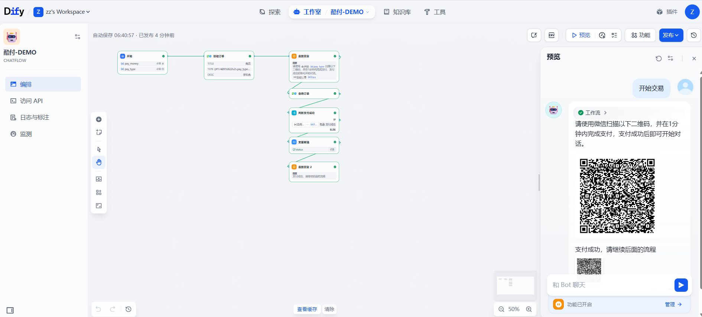

## Cuu Pay

**Co-Author:** [zjbjbj](https://github.com/zjbjbj)  
**Version:** 0.0.4  
**Type:** tool  
**Repo&Issues:** [https://github.com/zjbjbj/dify-plugin-cuu_pay](https://github.com/zjbjbj/dify-plugin-cuu_pay)

### Features
This is a payment service for workflow developers, enabling individual developers to monetize their valuable workflow creations.

### Highlights
- Alipay,WeChat Pay, supports credit card payments 
- A stepwise and transparent platform service fee  
- Individual developers do not need enterprise qualifications. 
- Fast access、One-stop service、Automatic settlement  
- Support asynchronous notification of the result after payment is completed
- Support page redirection after payment is completed

### Start
Go to Github, download the [chatflow](https://github.com/zjbjbj/dify-plugin-cuu_pay/blob/main/_assets/chatflow-DEMO.yml) example.
Go to Domestic site, download the [chatflow](https://www.cuupay.com/static/website/chatflow-DEMO.yml) example, and import it to start using.
